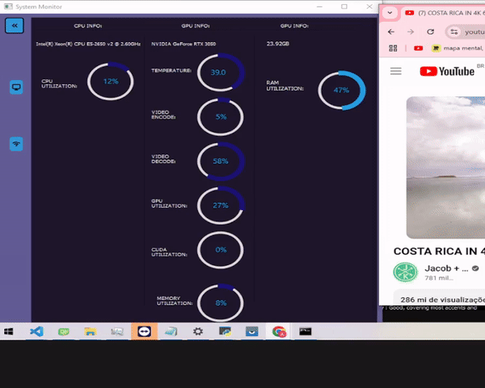

# System Monitoring with PySide2 Interface


This project is a real-time system monitor using PySide2 to provide a graphical interface. It displays CPU, GPU, and memory



## 🚀 Features

- **CPU Monitoring**: Displays the processor name and real-time usage percentage.
- **GPU Monitoring**: Displays the GPU name, temperature, memory usage, video encoding and decoding, and CUDA usage (if available).
- **RAM Monitoring**: Shows the total available RAM and current usage in real-time.

  
## 📋 Requirements

- **Python 3.8+**
- **Required Libraries:**:
  - https://github.com/tschoonj/GTK-for-Windows-Runtime-Environment-Installer/releases
  - PySide2
  - GPUtil
  - psutil
  - firebase-admin (opcional, para integração com Firebase)
  - pip install PySide2extn

## 💻 Project Structure

```
project/
├── ui/
│   ├── system_monitor.ui
├── src_1/
│   ├── ui_system_monitor.py
│   └── icones_interpreter.py
├── Qss/
│   ├── icons/_icons.qrc
│   ├── scss/.scss
├── JsonStyle/
│   └── style.json
└── main.py
```

## 📝 Contributing

1. Fork the project
2. Create your Feature Branch (`git checkout -b feature/AmazingFeature`)
3. Commit your changes (`git commit -m 'Add some AmazingFeature'`)
4. Push to the Branch (`git push origin feature/AmazingFeature`)
5. Open a Pull Request

## ✨ Acknowledgments
- anjalp For creating PySide2extn
- KhamisiKibet For creating Qt-PySide-Custom-Widgets
- Qt Community for support
- Project contributors


## 🔧 Installation

1. Clone the repository:
```bash
git clone https://github.com/ualers/Loading-Screen-PySide6-QCustomPerlinLoader.git
```

2. Install dependencies:
```bash
pip install -r requirements.txt
```

3. Download GTK-for-Windows:
- https://github.com/tschoonj/GTK-for-Windows-Runtime-Environment-Installer/releases

4. Download CUDA Toolkit:
- https://developer.nvidia.com/cuda-downloads